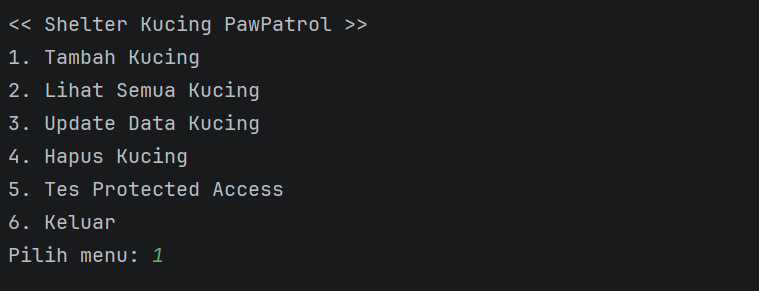
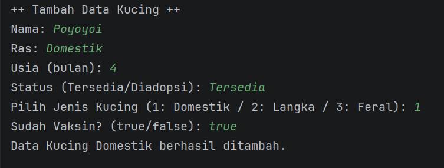
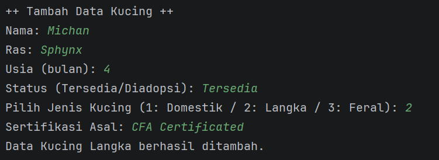
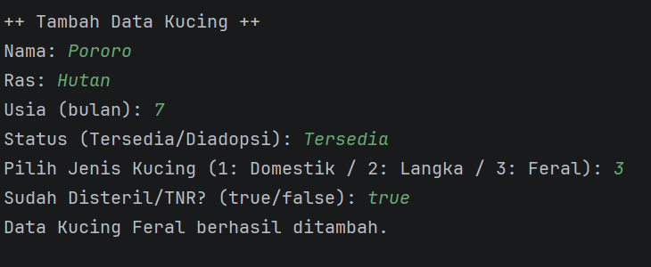
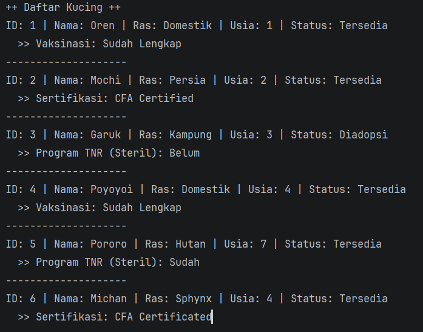
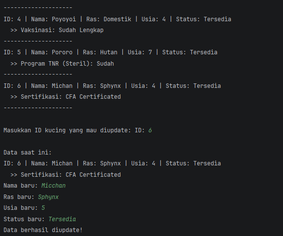
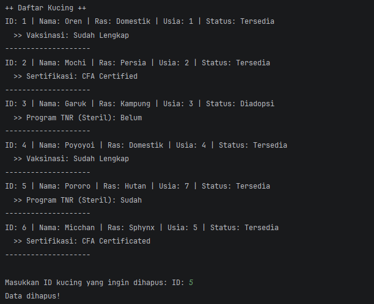
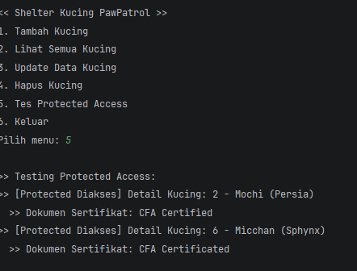

# POSTTEST_PBO

## POST TEST 1

## Sistem Manajemen Shelter Kucing PawPatrol 😼🙌

### A. Deskripsi Program
Program ini dibuat menggunakan bahasa pemrograman Java. Tujuan utamanya adalah untuk memudahkan pengelolaan data kucing yang ada di shelter, mulai dari pencatatan kucing baru hingga update status adopsi. Sistem ini dibangun menggunakan konsep Object-Oriented Programming (OOP) di mana data kucing dibungkus dalam sebuah Class, dan penyimpanan datanya menggunakan ArrayList agar bersifat dinamis (bisa tambah/hapus tanpa batas ukuran tetap). Program ini berjalan secara interaktif menggunakan looping menu, jadi pengguna bisa melakukan banyak operasi sampai memutuskan untuk keluar.

### B. Fitur Program
1. Menu Utama
- Pada bagian ini pengguna dapat melihat apa saja menu yang tersedia dan dapat diakses. Ada 5 opsi yang dapat dipilih oleh pengguna seperti yang terdapat pada gambar.
  
2. Create
- Fitur ini digunakan untuk menambah data kucing baru dengan cara,
  User input nama, ras, usia, status → Data disimpan ke ArrayList dengan ID otomatis.
  
3. Read
- Fitur ini digunakan untuk melihat daftar kucing yang terdapat di Shelter Pawpatrol.
  Program melakukan looping pada ArrayList dan menampilkan semua data yang tersimpan.
  
5. Update
- Fitur ini digunakan untuk mengubah atau memperbarui data kucing yang terdapat di shelter.
  User pilih ID kucing → Update nama/ras/usia/status tanpa mengubah ID.
   
6. Delete
- Fitur ini digunakan untuk menghapus data kucing yang ada.
  User pilih ID kucing → Data dihapus dari ArrayList (misal karena sudah diadopsi).

### C. Struktur Kode
Program ini terdiri dari 2 file Java utama yang saling berkaitan:

1. Kucing.java
- Class ini berfungsi sebagai blueprint atau cetakan untuk objek kucing. Di sini didefinisikan properti seperti id, nama, ras, usia, dan status. Class ini juga memiliki method getter/setter untuk encapsulasi data dan method untuk menampilkan info kucing.
3. Main.java
- Class ini merupakan entry point program. Berisi logika utama seperti menu interaktif, input user menggunakan Scanner, dan eksekusi fungsi CRUD menggunakan loop dan conditional statement.

### D. Output Program
| Fitur | Screenshot |
|-------|-----------|
| **Menu Utama** |  |
| **Tambah Data** |  |
| **Lihat Data** |  |
| **Update Data** |  |
| **Hapus Data** |  |
| **Exit** |  |

---

## POST TEST 2

### A. PENGERTIAN ENCAPSULATION DAN ACCESS MODIFIER
- Encapsulation (enkapsulasi) adalah salah satu konsep fundamental dalam Object-Oriented Programming (OOP) yang membungkus data (variabel) dan metode (fungsi) yang memanipulasinya menjadi satu kesatuan (kelas) serta membatasi akses langsung ke data tersebut dari luar
- Access modifier adalah kata kunci (keyword) yang menentukan visibilitas dan tingkat akses suatu class, method, atau atribut (field).

### B. PENERAPAN ENCAPSULATION

### 1. Tabel Access Modifier Atribut

| Atribut | Private | Getter | Setter | Validasi |
|---------|:-------:|:------:|:------:|:--------:|
| `id` | ✅ | `getId()` | ❌ | ID tidak bisa diubah |
| `nama` | ✅ | `getNama()` | `setNama()` | - |
| `ras` | ✅ | `getRas()` | `setRas()` | - |
| `usia` | ✅ | `getUsia()` | `setUsia()` | ✅ Usia > 0 |
| `status` | ✅ | `getStatus()` | `setStatus()` | - |

---

### 2. Tabel Metode Getter

| No | Method | Tipe Return | Deskripsi |
|:--:|--------|:-----------:|-----------|
| 1 | `getId()` | `int` | Mengambil nilai ID kucing |
| 2 | `getNama()` | `String` | Mengambil nilai nama kucing |
| 3 | `getRas()` | `String` | Mengambil nilai ras kucing |
| 4 | `getUsia()` | `int` | Mengambil nilai usia kucing |
| 5 | `getStatus()` | `String` | Mengambil nilai status kucing |

---

### 3. Tabel Metode Setter

| No | Method | Parameter | Deskripsi | Validasi |
|:--:|--------|:---------:|-----------|:--------:|
| 1 | `setNama(String nama)` | `String` | Mengubah nama kucing | - |
| 2 | `setRas(String ras)` | `String` | Mengubah ras kucing | - |
| 3 | `setUsia(int usia)` | `int` | Mengubah usia kucing | ✅ `usia > 0` |
| 4 | `setStatus(String status)` | `String` | Mengubah status kucing | - |

---

### 4. Tabel Access Modifier yang Digunakan

| Modifier | Lokasi | Contoh Kode | Keterangan |
|:--------:|--------|-------------|------------|
| `private`  | `Kucing.java` | `private int id;` | Hanya bisa diakses dalam class |
| `public`  | `Kucing.java` | `public String getNama()` | Bisa diakses dari mana saja |
| `protected` | `Kucing.java` | `protected String getDetailInternal()` | Bisa diakses subclass |
| `default`  | `Main.java` | `static ArrayList<Kucing> dataKucing` | Bisa diakses dalam package |

---

### C. Hasil Output
| Fitur | Screenshot |
|-------|-----------|
| **Menu Utama** |  |
| **Tambah Data** |  |
| **Lihat Data Kucing** |  |
| **Update Data Kucing** |  |
| **Hapus Kucing** |  |
| **Tes Protected Access** |  |
| **Keluar** |  |

---

## POST TEST 3

### A. PENGERTIAN INHERITENCE
Inheritance (pewarisan) adalah konsep di mana sebuah kelas (subclass/anak) dapat mewarisi atribut dan metode dari kelas lain (superclass/induk). Ini mempromosikan code reuse (penggunaan kembali kode), memungkinkan pembuatan kelas baru yang lebih spesifik berdasarkan kelas yang sudah ada, serta membangun hierarki kelas "is-a".

---

## B. Konsep OOP yang Diterapkan
| Konsep | Implementasi |
|--------|--------------|
| **Inheritance** | `Kucing` (Superclass) → `KucingDomestik`, `KucingLangka`, `KucingFeral` (Subclass) |
| **Hierarchical Inheritance** | Satu kelas induk memiliki 3 anak kelas sesuai kategori perawatan |
| **Encapsulation** | Atribut `private` pada `Kucing`, diakses via getter & setter |
| **Polymorphism** | `ArrayList<Kucing>` menyimpan berbagai subclass; method `tampilkanInfo()` di-`@Override` |
| **Access Modifier (`protected`)** | `getDetailInternal()` hanya dapat diakses oleh subclass (`KucingLangka`) |

---

## C. Fitur Sistem
- **Create**: Menambah data kucing dengan pilihan jenis (Domestik/Langka/Feral)
- **Read**: Menampilkan daftar lengkap dengan info spesifik tiap subclass
- **Update**: Mengubah data dasar (nama, ras, usia, status) berdasarkan ID
- **Delete**: Menghapus data berdasarkan ID
- **Tes Protected Access**: Mendemonstrasikan pewarisan & akses `protected`
- **Exit**: Menutup program

### D. Hasil Output
| Fitur | Screenshot |
|-------|-----------|
| **Menu Utama** |  |
| **Tambah Kucing Domestik** |  |
| **Tambah Kucing Langka** |  |
| **Tambah Kucing Feral** |  |
| **Lihat Semua Kucing** |  |
| **Update Data Kucing** |  |
| **Hapus Kucing** |  |
| **Tes Protected Access** |  |

---

## POST TEST 4

## A. Pengertian Polymorphism
**Polymorphism** (polimorfisme) adalah salah satu pilar utama dalam Pemrograman Berorientasi Objek (OOP) yang berasal dari kata Yunani *poly* (banyak) dan *morph* (bentuk). Secara konseptual, polimorfisme memungkinkan suatu objek atau referensi untuk mengambil banyak bentuk. Dalam praktik pemrograman, hal ini berarti metode dengan nama yang sama dapat memiliki perilaku berbeda tergantung pada tipe objek yang memanggilnya saat *runtime* (*dynamic binding*) atau berdasarkan parameter yang diberikan saat *compile-time* (*overloading*). Polimorfisme meningkatkan fleksibilitas kode, mempermudah pemeliharaan, dan memungkinkan penghapusan kode berulang (*code duplication*).

---

## B. Konsep Polymorphism yang Diterapkan

1. **Runtime Polymorphism (Method Overriding & Dynamic Method Dispatch)**
   - Kelas turunan (`KucingDomestik`, `KucingLangka`, `KucingFeral`) melakukan *override* terhadap metode `tampilkanInfo()`, `hitungBiayaPerawatan()`, dan `toString()` dari kelas induk `Kucing`.
   - Saat perulangan `for (Kucing k : dataKucing)` berjalan, pemanggilan `k.tampilkanInfo()` dan `k.hitungBiayaPerawatan()` secara otomatis mengeksekusi implementasi yang sesuai dengan tipe objek sebenarnya di memori, meskipun referensinya bertipe `Kucing`.

2. **Compile-time Polymorphism (Method Overloading)**
   - Terlihat pada kelas `Kucing` dengan metode `setStatus(String)` dan `setStatus(String, String)`, serta `hitungBiayaPerawatan(int)` dan `hitungBiayaPerawatan(int, boolean)`.
   - Kompilator memilih metode yang tepat berdasarkan jumlah dan tipe argumen yang dikirimkan saat pemanggilan.

3. **Upcasting & Generic Collection**
   - `ArrayList<Kucing>` digunakan sebagai wadah penyimpanan yang bersifat polimorfik. Objek dari ketiga subclass dapat dimasukkan ke dalam list yang sama berkat *upcasting* implisit.
   - Hal ini memungkinkan operasi CRUD dilakukan secara seragam tanpa perlu membuat array/list terpisah untuk setiap jenis kucing.

4. **Akses `protected` dalam Hierarki**
   - Metode `getDetailInternal()` pada `Kucing` dideklarasikan sebagai `protected`. Ini mendemonstrasikan bahwa polimorfisme dan enkapsulasi dapat berjalan beriringan: subclass (`KucingLangka`) dapat mengakses metode tersebut, namun kelas di luar hierarki tidak bisa.

---

## C. Fitur Sistem
| No | Fitur | Keterangan |
|----|-------|------------|
| 1 | **CRUD Interaktif** | Menu untuk Create, Read, Update, dan Delete data kucing |
| 2 | **Multi-Tipe Kucing** | Mendukung 3 entitas: Domestik, Langka, dan Feral dengan atribut |
| 3 | **Kalkulasi Biaya Dinamis** | Estimasi biaya perawatan otomatis menyesuaikan ras, vaksinasi, sertifikasi, dan status TNR |
| 4 | **Demo Protected Access** | Menu khusus (#5) untuk menguji aksesibilitas anggota kelas induk oleh subclass |
| 5 | **Auto-ID Generation** | Penomoran ID otomatis menggunakan `idCounter` static |
| 6 | **Logging Update** | Pencatatan alasan perubahan status pada konsol saat update dilakukan |

---

## D. Hasil Output

| Fitur | Screenshot |
|-------|-----------|
| **Tambah Kucing** |  |
| **Lihat Semua Kucing** |  |
| **Update Data Kucing** |  |
| **Hapus Kucing** |  |
| **Tes Protected Access** |  |

---

