# POSTTEST_PBO

## POST TEST 1

## Sistem Manajemen Shelter Kucing PawPatrol 😼🙌

### A. Deskripsi Program
Program ini dibuat menggunakan bahasa pemrograman Java. Tujuan utamanya adalah untuk memudahkan pengelolaan data kucing yang ada di shelter, mulai dari pencatatan kucing baru hingga update status adopsi. Sistem ini dibangun menggunakan konsep Object-Oriented Programming (OOP) di mana data kucing dibungkus dalam sebuah Class, dan penyimpanan datanya menggunakan ArrayList agar bersifat dinamis (bisa tambah/hapus tanpa batas ukuran tetap). Program ini berjalan secara interaktif menggunakan looping menu, jadi pengguna bisa melakukan banyak operasi sampai memutuskan untuk keluar.

### B. Fitur Program
1. Menu Utama
- Pada bagian ini pengguna dapat melihat apa saja menu yang tersedia dan dapat diakses. Ada 5 opsi yang dapat dipilih oleh pengguna seperti yang terdapat pada gambar.
  
2. Create
- Fitur ini digunakan untuk menambah data kucing baru dengan cara,
  User input nama, ras, usia, status → Data disimpan ke ArrayList dengan ID otomatis.
  
3. Read
- Fitur ini digunakan untuk melihat daftar kucing yang terdapat di Shelter Pawpatrol.
  Program melakukan looping pada ArrayList dan menampilkan semua data yang tersimpan.
  
5. Update
- Fitur ini digunakan untuk mengubah atau memperbarui data kucing yang terdapat di shelter.
  User pilih ID kucing → Update nama/ras/usia/status tanpa mengubah ID.
   
6. Delete
- Fitur ini digunakan untuk menghapus data kucing yang ada.
  User pilih ID kucing → Data dihapus dari ArrayList (misal karena sudah diadopsi).

### C. Struktur Kode
Program ini terdiri dari 2 file Java utama yang saling berkaitan:

1. Kucing.java
- Class ini berfungsi sebagai blueprint atau cetakan untuk objek kucing. Di sini didefinisikan properti seperti id, nama, ras, usia, dan status. Class ini juga memiliki method getter/setter untuk encapsulasi data dan method untuk menampilkan info kucing.
3. Main.java
- Class ini merupakan entry point program. Berisi logika utama seperti menu interaktif, input user menggunakan Scanner, dan eksekusi fungsi CRUD menggunakan loop dan conditional statement.

### D. Output Program
| Fitur | Screenshot |
|-------|-----------|
| **Menu Utama** | 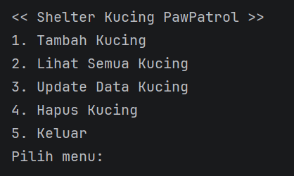 |
| **Tambah Data** | 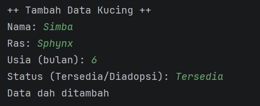 |
| **Lihat Data** | 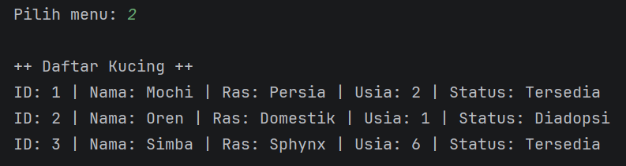 |
| **Update Data** | 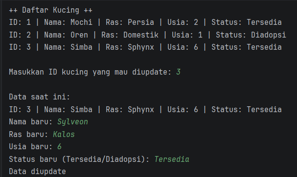 |
| **Hapus Data** | 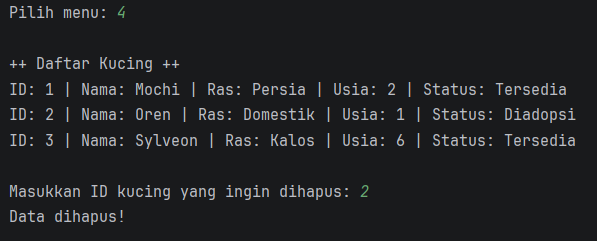 |
| **Exit** | 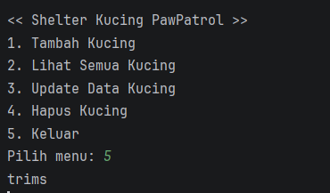 |

---

##POST TEST 2

###A. PENGERTIAN ENCAPSULATION DAN ACCESS MODIFIER
- Encapsulation (enkapsulasi) adalah salah satu konsep fundamental dalam Object-Oriented Programming (OOP) yang membungkus data (variabel) dan metode (fungsi) yang memanipulasinya menjadi satu kesatuan (kelas) serta membatasi akses langsung ke data tersebut dari luar
- Access modifier adalah kata kunci (keyword) yang menentukan visibilitas dan tingkat akses suatu class, method, atau atribut (field).

###B. PENERAPAN ENCAPSULATION

###1. Tabel Access Modifier Atribut

| Atribut | Private | Getter | Setter | Validasi |
|---------|:-------:|:------:|:------:|:--------:|
| `id` | ✅ | `getId()` | ❌ | ID tidak bisa diubah |
| `nama` | ✅ | `getNama()` | `setNama()` | - |
| `ras` | ✅ | `getRas()` | `setRas()` | - |
| `usia` | ✅ | `getUsia()` | `setUsia()` | ✅ Usia > 0 |
| `status` | ✅ | `getStatus()` | `setStatus()` | - |

---

###2. Tabel Metode Getter

| No | Method | Tipe Return | Deskripsi |
|:--:|--------|:-----------:|-----------|
| 1 | `getId()` | `int` | Mengambil nilai ID kucing |
| 2 | `getNama()` | `String` | Mengambil nilai nama kucing |
| 3 | `getRas()` | `String` | Mengambil nilai ras kucing |
| 4 | `getUsia()` | `int` | Mengambil nilai usia kucing |
| 5 | `getStatus()` | `String` | Mengambil nilai status kucing |

---

###3. Tabel Metode Setter

| No | Method | Parameter | Deskripsi | Validasi |
|:--:|--------|:---------:|-----------|:--------:|
| 1 | `setNama(String nama)` | `String` | Mengubah nama kucing | - |
| 2 | `setRas(String ras)` | `String` | Mengubah ras kucing | - |
| 3 | `setUsia(int usia)` | `int` | Mengubah usia kucing | ✅ `usia > 0` |
| 4 | `setStatus(String status)` | `String` | Mengubah status kucing | - |

---

###4. Tabel Access Modifier yang Digunakan

| Modifier | Lokasi | Contoh Kode | Keterangan |
|:--------:|--------|-------------|------------|
| `private`  | `Kucing.java` | `private int id;` | Hanya bisa diakses dalam class |
| `public`  | `Kucing.java` | `public String getNama()` | Bisa diakses dari mana saja |
| `protected` | `Kucing.java` | `protected String getDetailInternal()` | Bisa diakses subclass |
| `default`  | `Main.java` | `static ArrayList<Kucing> dataKucing` | Bisa diakses dalam package |

---

###C. Hasil Output
| Fitur | Screenshot |
|-------|-----------|
| **Menu Utama** | 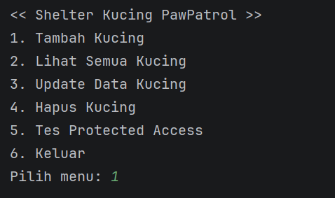 |
| **Tambah Data** | 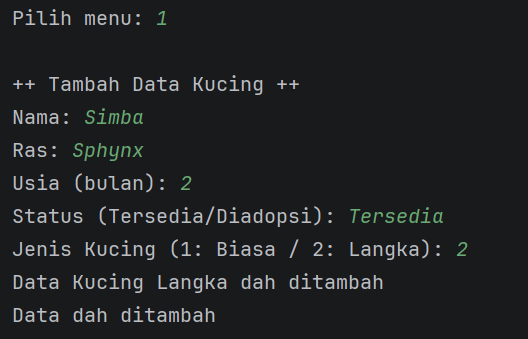 |
| **Lihat Data Kucing** | 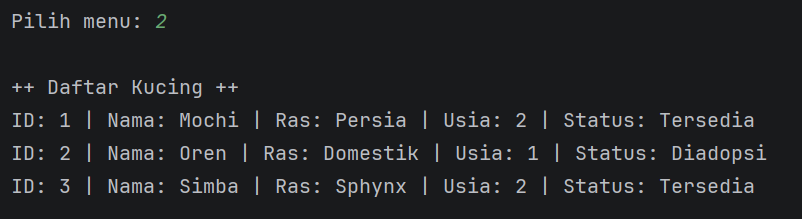 |
| **Update Data Kucing** | 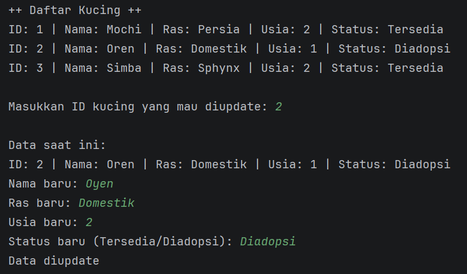 |
| **Hapus Kucing** | 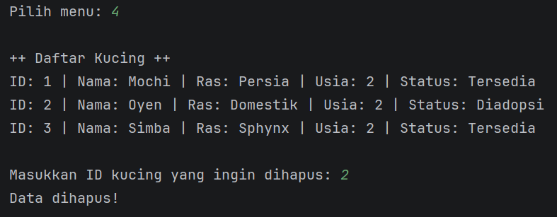 |
| **Tes Protected Access** | 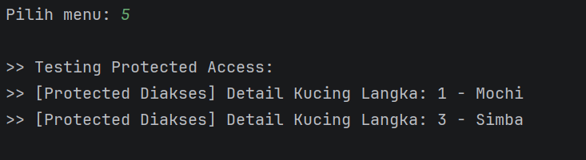 |
| **Keluar** | 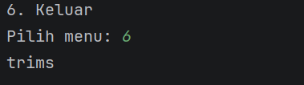 |
